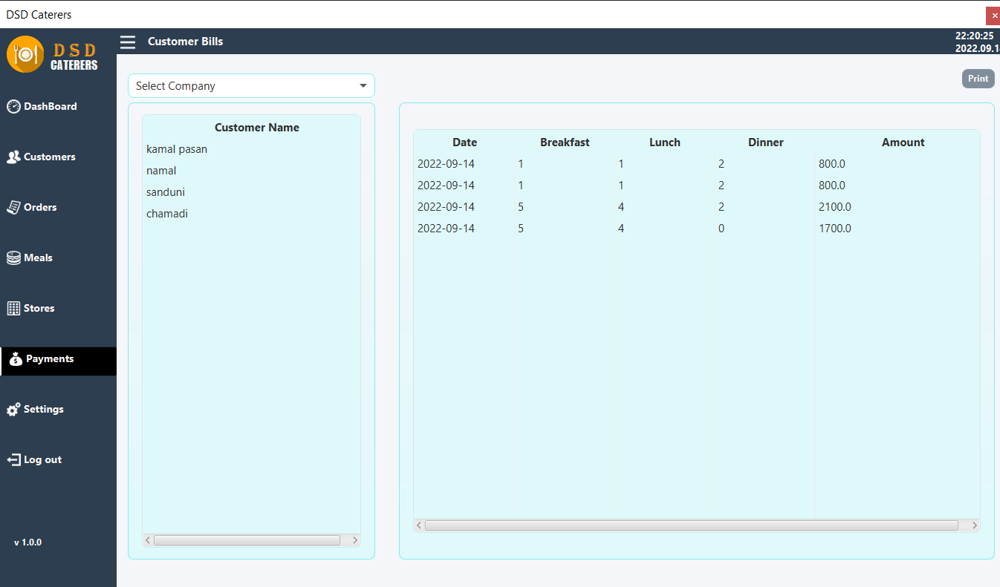

## DSD Caterers

DSD Caterers (Pvt) Ltd was founded in 2013. serve breakfast, lunch and dinner mainly to two companies, Namely, the Denta Factory and the Ninja Factory of the E. B. Creasy Group.
This company is one of the most recognized in the industry for providing clean and high quality food during these 8 years.

their provide between 200 and 250 employees. These factories tell them how many people need to get food a day. Accordingly, they provide food to those factories on time.

For that I Created an easy Catering mangement system.This is the first semester project of IJSE. For that I used the following technical tool.

java | JavaFx | MySql | CSS

## Screenshots

### 1

### 2

### 3

### 4

### 5

### 6

### 7

### 8

### 9

